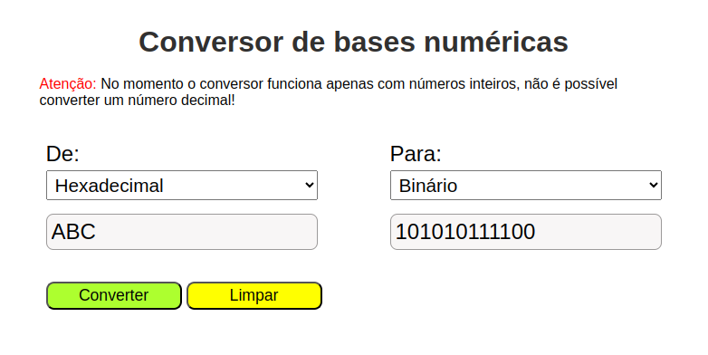

# Conversor de Bases Numéricas
Conversor simples, apenas para prática de codificação em Angular.
Realiza a conversão para as seguintes bases: Decimal, Hexadecimal, Binário e Octal

## Tecnologias

`Angular 16.2.14` & 
`Node v18.19.1`

## Como executar
Considerando que você já tenha o npm, Node, Angular e git instalados e configurados na sua máquina execute os seguintes comandos:

### No git
  `git clone https://github.com/InacioSouza/Conversor-de-bases-Angular.git` para baixar o projeto

### Na pasta do projeto
`npm install` para baixar as dependências

`ng serve` para rodar o projeto

### No navegador

cole a URL `http://localhost:4200/` na barra de navegação.

Com estes passos a aplicação estará funcionando. A interface abaixo será renderizada na sua tela:

